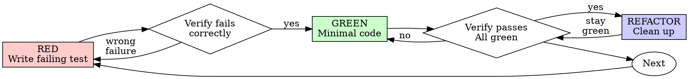

# Test-Driven Development (TDD)

## Overview

Write the test first. Watch it fail. Write minimal code to pass.

**Core principle:** If you didn't watch the test fail, you don't know if it tests the right thing.

**Violating the letter of the rules is violating the spirit of the rules.**

## When to Use

**Always:**
- New features
- Bug fixes
- Refactoring
- Behavior changes

**Exceptions (ask your human partner):**
- Throwaway prototypes
- Generated code
- Configuration files

Thinking "skip TDD just this once"? Stop. That's rationalization.

## The Iron Law

```
NO PRODUCTION CODE WITHOUT A FAILING TEST FIRST
```

Write code before the test? Delete it. Start over.

**No exceptions:**
- Don't keep it as "reference"
- Don't "adapt" it while writing tests
- Don't look at it
- Delete means delete

Implement fresh from tests. Period.

## Red-Green-Refactor



### RED - Write Failing Test

Write one minimal test showing what should happen. Design the interface from the caller's perspective.

```python
# Python
def test_cart_total_with_single_item():
    cart = Cart()
    cart.add(Item("apple", price=1.50), quantity=2)
    assert cart.total() == 3.00
```

```go
// Go
func TestCartTotalWithSingleItem(t *testing.T) {
    cart := NewCart()
    cart.Add(Item{Name: "apple", Price: 1.50}, 2)
    assert.Equal(t, 3.00, cart.Total())
}
```

```typescript
// TypeScript
test("cart total with single item", () => {
  const cart = new Cart();
  cart.add(new Item("apple", 1.50), 2);
  expect(cart.total()).toBe(3.00);
});
```

<Good>
```typescript
test('retries failed operations 3 times', async () => {
  let attempts = 0;
  const operation = () => {
    attempts++;
    if (attempts < 3) throw new Error('fail');
    return 'success';
  };

  const result = await retryOperation(operation);

  expect(result).toBe('success');
  expect(attempts).toBe(3);
});
```
Clear name, tests real behavior, one thing
</Good>

<Bad>
```typescript
test('retry works', async () => {
  const mock = jest.fn()
    .mockRejectedValueOnce(new Error())
    .mockRejectedValueOnce(new Error())
    .mockResolvedValueOnce('success');
  await retryOperation(mock);
  expect(mock).toHaveBeenCalledTimes(3);
});
```
Vague name, tests mock not code
</Bad>

**Requirements:**
- One behavior
- Clear name
- Real code (no mocks unless unavoidable)

### Verify RED - Watch It Fail

**MANDATORY. Never skip.**

Run the test. Confirm:
- Test fails (not errors)
- Failure message is expected
- Fails because feature missing (not typos)

**Test passes?** You're testing existing behavior. Fix test.

**Test errors?** Fix error, re-run until it fails correctly.

### GREEN - Minimal Code

Write simplest code to pass the test.

<Good>
```typescript
async function retryOperation<T>(fn: () => Promise<T>): Promise<T> {
  for (let i = 0; i < 3; i++) {
    try {
      return await fn();
    } catch (e) {
      if (i === 2) throw e;
    }
  }
  throw new Error('unreachable');
}
```
Just enough to pass
</Good>

<Bad>
```typescript
async function retryOperation<T>(
  fn: () => Promise<T>,
  options?: {
    maxRetries?: number;
    backoff?: 'linear' | 'exponential';
    onRetry?: (attempt: number) => void;
  }
): Promise<T> {
  // YAGNI
}
```
Over-engineered
</Bad>

Don't add features, refactor other code, or "improve" beyond the test.

### Verify GREEN - Watch It Pass

**MANDATORY.**

Confirm:
- Test passes
- Other tests still pass
- Output pristine (no errors, warnings)

**Test fails?** Fix code, not test.

**Other tests fail?** Fix now.

### REFACTOR - Clean Up

After green only:
- Remove duplication
- Improve names
- Extract helpers

Keep tests green. Don't add behavior.

### Repeat

Next failing test for next feature.

## Bug Fixing with TDD

Always reproduce a bug with a failing test *before* fixing it.

```
1. Write a test that exposes the bug → RED
2. Fix the bug → GREEN
3. Refactor if needed → GREEN
4. Commit
```

This guarantees the bug is fixed and won't regress.

**Example:**

**RED**
```typescript
test('rejects empty email', async () => {
  const result = await submitForm({ email: '' });
  expect(result.error).toBe('Email required');
});
```

**Verify RED** — `FAIL: expected 'Email required', got undefined`

**GREEN**
```typescript
function submitForm(data: FormData) {
  if (!data.email?.trim()) {
    return { error: 'Email required' };
  }
  // ...
}
```

**Verify GREEN** — `PASS`

**REFACTOR** — Extract validation for multiple fields if needed.

## Good Tests

| Quality | Good | Bad |
|---------|------|-----|
| **Minimal** | One thing. "and" in name? Split it. | `test('validates email and domain and whitespace')` |
| **Clear** | Name describes behavior | `test('test1')` |
| **Shows intent** | Demonstrates desired API | Obscures what code should do |

## Outside-In vs Inside-Out

**Inside-Out (Chicago/Classic TDD)**
- Start with the smallest unit (pure functions, data structures)
- Build up toward higher-level components
- Good for: well-understood domains, algorithmic code
- Risk: design misfit between layers discovered late

**Outside-In (London/Mockist TDD)**
- Start with an acceptance/integration test (fails)
- Implement layer by layer; mock collaborators not yet built
- Drive inner layers' interfaces from how outer layers need to use them
- Good for: web APIs, event-driven systems, unknown domains
- Risk: over-mocking; tests don't catch integration issues

Both are valid. Choose based on context. Many teams use outside-in at the feature level and inside-out at the unit level.

## Test Doubles

Use the simplest double that works. Don't mock what you own.

| Double | When to use |
|--------|------------|
| **Fake** | Real working implementation, simplified (in-memory DB, fake clock) |
| **Stub** | Provide canned responses for queries; don't verify calls |
| **Mock** | Verify that specific interactions occurred; use sparingly |
| **Spy** | Record calls on a real object; assert after the fact |

```python
# Prefer fakes over mocks for infrastructure
class FakeUserRepository:
    def __init__(self):
        self._users: dict[str, User] = {}

    def save(self, user: User) -> None:
        self._users[user.id] = user

    def find_by_id(self, user_id: str) -> User | None:
        return self._users.get(user_id)

def test_register_user_saves_to_repository():
    repo = FakeUserRepository()
    service = UserService(repo)
    service.register(name="Alice", email="alice@example.com")
    assert repo.find_by_id("alice@example.com") is not None
```

## Triangulation

When the simplest implementation would just be `return 42`, write a second test that forces generalization.

```python
def test_add_returns_sum():
    assert add(2, 3) == 5   # Could fake with: return 5

def test_add_with_different_values():
    assert add(10, 1) == 11  # Forces real implementation
```

## When Tests Are Hard to Write

If writing the test is painful, the design is telling you something:

| Symptom | Signal | Fix |
|---------|--------|-----|
| Needs many objects to set up | Too much coupling | Break dependencies |
| Can only test through side effects | Logic buried in I/O | Separate pure logic |
| Must mock many things | Too many collaborators | Reduce responsibilities |
| Test mirrors implementation exactly | Testing internals | Test behavior, not structure |
| Tests break on every refactor | Wrong abstraction level | Test the public contract |
| Don't know how to test | Design unclear | Write wished-for API. Simplify interface. |
| Test setup huge | Excess complexity | Extract helpers. Still complex? Simplify design. |

## TDD Rhythms

**Micro-cycle (seconds to minutes)**
Write test → run → implement → run → refactor → run → commit

**Feature cycle (minutes to hours)**
Write acceptance test → drive out units via TDD → acceptance test goes green → commit

**Refactoring cycle (any time on green)**
Rename → extract → inline → move → simplify → verify green → commit

## Why Order Matters

**"I'll write tests after to verify it works"**

Tests written after code pass immediately. Passing immediately proves nothing:
- Might test wrong thing
- Might test implementation, not behavior
- Might miss edge cases you forgot
- You never saw it catch the bug

Test-first forces you to see the test fail, proving it actually tests something.

**"I already manually tested all the edge cases"**

Manual testing is ad-hoc. You think you tested everything but:
- No record of what you tested
- Can't re-run when code changes
- Easy to forget cases under pressure
- "It worked when I tried it" ≠ comprehensive

Automated tests are systematic. They run the same way every time.

**"Deleting X hours of work is wasteful"**

Sunk cost fallacy. The time is already gone. Your choice now:
- Delete and rewrite with TDD (X more hours, high confidence)
- Keep it and add tests after (30 min, low confidence, likely bugs)

The "waste" is keeping code you can't trust. Working code without real tests is technical debt.

**"TDD is dogmatic, being pragmatic means adapting"**

TDD IS pragmatic:
- Finds bugs before commit (faster than debugging after)
- Prevents regressions (tests catch breaks immediately)
- Documents behavior (tests show how to use code)
- Enables refactoring (change freely, tests catch breaks)

"Pragmatic" shortcuts = debugging in production = slower.

**"Tests after achieve the same goals - it's spirit not ritual"**

No. Tests-after answer "What does this do?" Tests-first answer "What should this do?"

Tests-after are biased by your implementation. You test what you built, not what's required. You verify remembered edge cases, not discovered ones.

Tests-first force edge case discovery before implementing. Tests-after verify you remembered everything (you didn't).

30 minutes of tests after ≠ TDD. You get coverage, lose proof tests work.

## Common Rationalizations

| Excuse | Reality |
|--------|---------|
| "Too simple to test" | Simple code breaks. Test takes 30 seconds. |
| "I'll test after" | Tests passing immediately prove nothing. |
| "Tests after achieve same goals" | Tests-after = "what does this do?" Tests-first = "what should this do?" |
| "Already manually tested" | Ad-hoc ≠ systematic. No record, can't re-run. |
| "Deleting X hours is wasteful" | Sunk cost fallacy. Keeping unverified code is technical debt. |
| "Keep as reference, write tests first" | You'll adapt it. That's testing after. Delete means delete. |
| "Need to explore first" | Fine. Throw away exploration, start with TDD. |
| "Test hard = design unclear" | Listen to test. Hard to test = hard to use. |
| "TDD will slow me down" | TDD faster than debugging. Pragmatic = test-first. |
| "Manual test faster" | Manual doesn't prove edge cases. You'll re-test every change. |
| "Existing code has no tests" | You're improving it. Add tests for existing code. |

## Red Flags - STOP and Start Over

- Code before test
- Test after implementation
- Test passes immediately
- Can't explain why test failed
- Tests added "later"
- Rationalizing "just this once"
- "I already manually tested it"
- "Tests after achieve the same purpose"
- "It's about spirit not ritual"
- "Keep as reference" or "adapt existing code"
- "Already spent X hours, deleting is wasteful"
- "TDD is dogmatic, I'm being pragmatic"
- "This is different because..."

**All of these mean: Delete code. Start over with TDD.**

## Anti-Patterns to Avoid

- **Test-last**: Writing tests after implementation means tests confirm code, not drive design
- **God test**: One test that covers everything — split into focused tests
- **Fragile test**: Breaks when unrelated code changes — test behavior, not structure
- **Slow test**: Tests that hit the network/disk/sleep — use fakes and in-memory stores
- **Commented-out tests**: Just delete them; if the behavior matters, write a real test
- **Mocking internals**: If you mock private methods you're testing implementation, not behavior
- **Skipping RED**: Writing code then writing a test that passes is not TDD

## Verification Checklist

Before marking work complete:

- [ ] Every new function/method has a test
- [ ] Watched each test fail before implementing
- [ ] Each test failed for expected reason (feature missing, not typo)
- [ ] Wrote minimal code to pass each test
- [ ] All tests pass
- [ ] Output pristine (no errors, warnings)
- [ ] Tests use real code (mocks only if unavoidable)
- [ ] Edge cases and errors covered

Can't check all boxes? You skipped TDD. Start over.

## Final Rule

```
Production code → test exists and failed first
Otherwise → not TDD
```

No exceptions without your human partner's permission.
